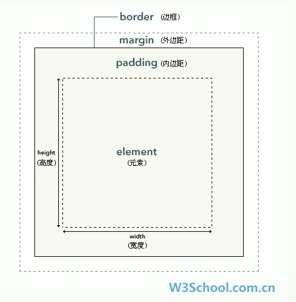

## CSS

通过CSS可以分别为网页的每一个层来设置样式

### CSS编写位置

#### 方式一：在标签内部通过style属性来设置元素样式（内联 / 行内样式）

- 问题1：样式只能对一个标签生效，如果希望多个标签生效则必须每个元素都复制一遍
- 问题2：当样式发生变化，则需要一个一个修改

```html
<p style="color: red; font-size: 30px">这是一段内容</p>
```

#### 方式二：将样式编写到head中的style标签中（内部样式表）

- 通过CSS的选择器来选中元素并为其设置样式

- 可以同时为多个标签设置样式，并且修改时只需要修改移除即可

- 问题：内部样式表只能对一个网页起作用，里面的样式不能跨页面使用

```html
<!DOCTYPE html>
<html lang="en">
<head>
    <meta charset="UTF-8">
    <title>Title</title>
    <style>
        p{
            color: red;
            font-size: 30px;
        }
    </style>
</head>
```

#### 方式三：将CSS样式编写到外部CSS文件中（外部样式表）

- html文件

- 通过link标签来引入外部的CSS文件
  
  ```html
  <!DOCTYPE html>
  <html lang="en">
  <head>
      <meta charset="UTF-8">
      <title>Title</title>
      <link rel="stylesheet" href="./demo2.css">
  </head>
  <body>
      <p>这是一段内容</p>
  </body>
  </html>
  ```

- css文件
  
  ```css
  p{
      color: red;
      font-size: 30px;
  }
  ```

### CSS语法

#### CSS的注释

```css
/* 这是一段注释 */
```

#### 基本语法

- CSS选择器：通过选择器可以选中页面中执行的元素

- 声明块：通过声明块来指定要为元素设置的样式
  
  - 一个样式名对应一个样式值，名和值之间使用 ":" 连接，以 ";" 结尾

```css
css选择器{
    /* 这是一段声明块 */
}
```

### 选择器

#### 元素选择器

- 根据标签名来选中指定的元素，例如：

- 语法：标签名{}
  
  ```css
  p{}
  h1{}
  div{}
  ```

#### ID选择器

- 根据元素的id属性值选中一个元素

- 语法：#id属性值{}

- 需要在标签中设置id属性，例如：
  
  ```html
  <p id="content">这是一段内容</p>
  ```

- Id选择器使用，例如：
  
  ```css
  #content{
      color: red;
  }
  ```

#### 类选择器

- 根据元素的class属性值选中一组元素

- 语法：.class属性值{}

- 需要在标签中设置class属性，例如：
  
  ```html
  <p class="content">这是使用class属性值的内容1</p>
  <p class="content">这是使用class属性值的内容2</p>
  ```

- 类选择器的使用，例如：
  
  ```css
  .content{
      color: red;
  }
  ```

- 可以同时为一个元素指定多个class属性
  
  ```html
  <p class="content value">这是使用class属性值的内容1</p>
  ```

#### 通配选择器

- 选中页面的所有元素

- 语法：*{}
  
  ```css
  *{
      color: red;
  }
  ```

#### 交集选择器

- 选中同时复合多个条件的元素

- 语法：选择器n{}

- 注意：如果有元素选择器，必须使用元素选择器开头

- 例如：
  
  ```html
  <div class="red">这是div标签</div>
  <p class="red">这是p标签</p>
  ```
  
  ```css
  .red{
      color: red;
  }
  div.red{
      color: green;
  }
  ```

#### 并集选择器（选择器分组）

- 同时选择多个选择对应的元素

- 语法：选择器1, 选择器2, 选择器n{}

- 例如：
  
  ```html
  <h1>这是一个h1</h1>
  <span>这是一个span</span>
  ```
  
  ```css
  h1, span{
      color: red;
  }
  ```

#### 子元素选择器

- 选中指定父元素的指定子元素

- 语法：父元素 > 子元素

- 例如：
  
  ```html
      <div>
          <p>
              我是div中的p元素
              <span>我的p元素中的span</span>
          </p>
          <span>我的div中的span元素</span>
      </div>
      <span>我的div外的span</span>
  ```
  
  ```css
  div > span{
      color: green;
  }
  ```

#### 后代元素选择器

- 选中指定元素内的指定后代元素

- 语法：祖先 后代{}

- 例如：
  
  ```html
      <div>
          <p>
              我是div中的p元素
              <span>我的p元素中的span</span>
          </p>
          <span>我的div中的span元素</span>
      </div>
      <span>我的div外的span</span>
  ```
  
  ```css
  div span{
      color: red;
  }
  ```

#### 兄弟选择器1

- 选择下一个兄弟

- 语法：前一个 + 下一个

- 例如：
  
  ```html
      <div>
          <p>
              我是div中的p元素
              <span>我的p元素中的span</span>
          </p>
          <span>我的div中的span元素</span>
      </div>
      <span>我的div外的span</span>
  ```
  
  ```css
  p + span{
      color: red;
  }
  ```

#### 兄弟选择器2

- 选择下边所有的兄弟元素

- 语法：前一个 ~ 后面的元素

- 例如：
  
  ```html
      <div>
          <p>
              我是div中的p元素
              <span>我的p元素中的span</span>
          </p>
          <span>我的div中的span元素</span>
          <span>我的div中的span元素</span>
          <span>我的div中的span元素</span>
          <span>我的div中的span元素</span>
      </div>
      <span>我的div外的span</span>
  ```
  
  ```css
      p ~ span{
          color: red;
      }
  ```

#### 属性选择器

- 语法：
  
  - [属性名]：表示选择含有指定属性的元素
  
  - [属性名=属性值]：表示选择含有指定属性和属性值的元素
  
  - [属性名^=属性值]：表示选择属性值以指定值开头的元素
  
  - [属性名$=属性值]：表示选择属性值以指定值结尾的元素
  
  - [属性名*=属性值]：表示选择属性值中含有某值的元素

- 例如：
  
  ```html
  <body>
      <p title="a">123456789</p>
      <p title="b">987654321</p>
      <p>741852963</p>
  </body>
  ```
  
  ```css
      p[title]{
          color: red;
      }
  
      p[title=a]{
          color: green;
      }
  ```

#### 伪类选择器

- 用来描述一个元素的特殊状态，例如：
  
  - 第一个子元素
  
  - 被点击的元素
  
  - 鼠标移入的元素

- 一般使用 ":" 开头
  
  - :first:child 第一个子元素
  
  - :last-child 最后一个子元素
  
  - :nth-child 选中第n个子元素
    
    - 如果直接写n，则表示所有
    
    - 如果写2n或者even，则表示偶数位的元素
    
    - 如果写2n + 1或者odd，则表示奇数位的元素
  
  - :first-of-type、last-of-type和nth-of-type
    
    - 以上三个伪类功能与上述的伪类类似，不同的是在同类型中进行排序
  
  - :not()：否定伪类，将符合条件的元素从选择器中去除
  
  - :hover：用来表示鼠标移入的状态
  
  - :active：用来表示鼠标点击的状态

- 例如：
  
  ```html
  <body>
      <ul>
          <li>第一个</li>
          <li>第二个</li>
          <li>第三个</li>
          <li>第四个</li>
          <li>第五个</li>
      </ul>
  </body>
  ```
  
  ```css
  <style>
      ul > li:first-child{
          color: red;
      }
      ul > li:last-child{
          color: green;
      }
      ul > li:nth-child(3){
          color: aqua;
      }
      /*ul > li:not(:nth-child(4)){*/
      /*    color: yellow;*/
      /*}*/
  </style>
  ```

#### 超链接的伪类

- :link：用来表示没有访问过的链接（正常的链接）

- :visited：用来表示访问过的链接

- 例如：
  
  ```html
  <body>
      <a href="http://www.baidu.com">访问过的链接</a>
      <a href="http://www.baidu123.com">没访问过的链接</a>
  </body>
  ```
  
  ```css
  <style>
      a:link{
          color: red;
      }
      a:visited{
          color: green;
      }
  </style>
  ```

### 伪元素

- 表示页面中一些特殊的并不真实的存在的元素（特殊的位置）

- 伪元素使用 "::" 开头
  
  - ::first-letter：表示第一个字母
  
  - ::first-line：表示第一行
  
  - ::selection：表示选中的内容
  
  - ::before 和 ::after
    
    - 必须结合content属性来使用

- 例如：
  
  ```html
  <body>
      <div>hello</div>
      <p>Lorem ipsum dolor sit amet, consectetur adipisicing elit. A ab amet asperiores assumenda distinctio dolor ea earum fugit ipsam iure, modi, neque nulla quam quas ullam veritatis vero voluptatem voluptatibus.</p>
  </body>
  ```
  
  ```css
  <style>
      p::first-letter{
          font-size: 50px;
      }
      p::first-line{
          color: green;
      }
      p::selection{
          background: yellow;
      }
      div::before{
          content: "hi!";
          color: red;
      }
      div::after{
          content: "hhh";
          color: yellow;
      }
  </style>
  ```

### 长度单位

- 像素
  
  - 屏幕实际上是由一个个小点构成的
  
  - 不同屏幕的像素大小是不同的，像素越小的屏幕显示的效果越清晰

- 百分比
  
  - 可以讲属性值设置为相当于父元素属性的百分比
  
  - 设置百分比可以使子元素跟随父元素的改变而改变

- em
  
  - 相对于元素的字体大小来计算的
  
  - 1em = 1font-size
  
  - em会根据字体大小的改变而改变

- rem
  
  - 相对于根元素的字体大小来计算的

### 盒子模型

- CSS中将页面中的所有元素都设置成了一个矩形的盒子，将元素设置为矩形的盒子后，对页面的布局就变成了将不同的盒子摆放到不同的位置
  
  - 内容区（content）
  
  - 内边距（padding）
  
  - 边框（border）
  
  - 外边距（margin）



#### 内容区

内容区，元素中的所有子元素和文本内容都在内容区中排列

内容去的大小由width和height两个属性来设置

- width：设置内容区的宽带

- height：设置内容区的高度

#### 边框（border）

边框，属于盒子的边缘，边框里边属于盒子内部，出了边框都是盒子的外部

边框的大小会影响到整个盒子的大小

要设置边框，至少要设置三个样式：

- border-width：边框的高度
  
  - 四个值：上 右 下 左
  
  - 三个值：上 左右 下
  
  - 两个值：上下 左右
  
  - 一个值：上下左右
  
  - 也可以设置为：border-xxx-width用来指定某个边框的宽度，xxx可以是top、right、bottom、left

- border-color：边框的颜色，也可以像border-width一样指定四个边的颜色，规则和border-width一样

- border-style：边框的样式，也可以像border-width一样指定四个边的颜色，规则和border-width一样
  
  - solid：实现
  
  - dotted：点状虚线
  
  - dashed：线状虚线
  
  - double：双线

- 简写：使用border属性，该属性可以同时设置边框所有相关样式，没有顺序要求
  
  ```css
  border: 1px solid #000;
  ```

- 还可以设置border-xxx：用于设置某个边框的样式，规则和border一样
  
  - border-top、border-right、border-bottom、border-left

#### 内边距（padding）

- 内容区和边框之间的距离是内边距

- 内边距会影响到盒子的大小，盒子的颜色会延伸到内边距上

- 四个方向的内边距
  
  - padding-top
  
  - padding-right
  
  - padding-bottom
  
  - padding-left
  
  - 简写：padding：top right bottom left;

- 盒子的可见大小由：内容区、内边距和边框组成

#### 外边距（margin）

- 不会影响盒子可见的大小

- 但是外边距会影响盒子的位置

- 默认情况下，设置左和上外边距会移动自身，设置右和下外边距会移动其他元素

- 四个方向的外边距
  
  - margin-top、margin-right、margin-bottom、margin-left
  
  - 简写：margin：top right bottom left;

### 轮廓阴影和圆角

#### 轮廓

- outline：用来设置元素的轮廓线，用法和border一样

- 轮廓和边框的区别：轮播不会影响到可见框的大小
  
  ```css
  outline: 10px solid red;
  ```

#### 阴影

- box-shadow：用来设置元素的阴影效果，阴影不会影响到页面布局

- 语法：box-shadow：水平偏移量 垂直偏移量 阴影模糊 颜色
  
  ```css
  box-shadow: 10px 8px 10px red;
  ```

#### 圆角

- border-radius：用来设置圆角

- border-top-left-radius：用来设置左上角圆角

- border-top-right-radius：用来设置右上角圆角

- border-bottom-left-radius：用来设置左下角圆角

- border-bottom-right-radius：用来设置右下角圆角
  
  ```css
  border-radius: 10px;
  ```

### 浮动

- 可以使一个元素向其父元素的左侧或者右侧移动

- float属性来设置元素的浮动
  
  - none：默认值，元素不浮动
  
  - left：元素向左浮动
  
  - right：元素向右浮动
  
  ```html
  <body>
      <div class="box1"></div>
      <div class="box2"></div>
  </body>
  ```
  
  ```css
      .box1{
          width: 200px;
          height: 200px;
          background: #bbffaa;
          float: left;
      }
  
      .box2{
          width: 200px;
          height: 200px;
          background: red;
          float: left;
      }
  ```

- 此时的box1和box2会横向排列

#### 高度塌陷

- 在浮动布局中，父元素的高度默认是被子元素撑开的

- 当子元素浮动后，其会完全脱离文档流，子元素会从文档流中脱离，将会无法撑起父元素的高度，导致父元素的高度丢失

- **解决方法：BFC（Block Formatting Context）块级格式化环境**

- BFC：是CSS中的一个隐含属性，可以为一个元素开启BFC，开启后该元素会编程一个独立的布局区域

- BFC开启后的特点：
  
  - 元素不会被浮动元素所覆盖
  
  - 子元素和父元素的外边距不会重叠
  
  - 元素可以包含浮动的子元素

- 设置方式：将元素的overflow设置为hidden、auto等属性
  
  ```html
  <body>
      <div class="outer">
          <div class="inner"></div>
      </div>
  </body>
  ```
  
  ```css
      .outer{
          border: 10px solid red;
          overflow: auto;
      }
      .inner{
          width: 100px;
          height: 100px;
          background: #bfa;
          float: left;
      }
  ```

#### clear属性

- 如果不希望某个元素因为其他元素浮动的影响而改变位置则可以通过clear属性清除浮动元素对当前元素所产生的影响

- 作用：清除浮动元素对当前元素所产生的影响
  
  - left：清除左侧浮动元素对当前元素的影响
  
  - right：清除右侧浮动元素对当前元素的影响
  
  - both：清除两侧中最大影响的那侧
  
  ```html
  <body>
      <div class="box1">1</div>
      <div class="box2">2</div>
      <div class="box3">3</div>
  </body>
  ```
  
  ```css
      .box1, .box2, .box3{
          width: 200px;
          height: 200px;
          font-size: 50px;
      }
  
      .box1{
          background: #bbffaa;
          float: left;
      }
  
      .box2{
          background: red;
          float: left;
      }
  
      .box3{
          background: orange;
          clear: left;
      }
  ```

#### 清除高度塌陷解决方案

```html
<body>
    <div class="box1">
        <div class="box2"></div>
    </div>
</body>
```

```css
    .box1 {
        border: 10px solid red;
    }

    .box2 {
        width: 100px;
        height: 100px;
        background: #bbffaa;
        float: left;
    }

    .box1::after {
        content: '';
        display: block;
        clear: both;
    }
```

### 定位

- 通过定位可以讲元素摆放到页面的任意位置

- 使用position属性来设置定位
  
  - static：默认值，表示没有开启定位
  
  - relative：相对定位
  
  - absolute：绝对定位
  
  - fixed：固定定位
  
  - sticky：粘滞定位

#### 相对定位

- 开启相对定位后，如果不设置偏移量则不会发生任何变化

- 参照物：元素在文档流中的位置进行定位

- 开启相对定位后，元素不会从文档流中脱离

- 偏移量：可以通过偏移量来设置元素的位置
  
  - top：定位元素和定位位置上边的距离
  
  - bottom：定位元素和定位位置下边的距离
  
  - left：定位元素和定位位置左边的距离
  
  - right：定位元素和定位位置右边的距离

#### 绝对定位

- 开启绝对定位后，如果不设置偏移量元素的位置，不会发生变化

- 开启绝对定位后，元素会从文档流中脱离

- 绝对定位是相对于其包含块进行定位的
  
  - 包含块就是离他最近的开启了定位的父元素，如果所有的父元素都没有开启定位，则根元素就是它的包含块

#### 固定定位

- 固定定位也是一种绝对定位，所有固定定位的大部分特点都和绝对定位一样

- 唯一不同的是固定定位永远参照于浏览器的视口进行定位

- 固定定位的元素不会随着滚动条的滚动而滚动

#### 粘滞定位

- 粘滞定位和相对定位的特点基本一致

- 不同的是粘滞定位可以在元素到达某个位置的时候将其固定

### 字体相关样式

- color：用来设置字体颜色

- font-size：字体大小

- font-family：字体的格式

- line-height：设置行高

- text-align：文本水平对齐

- vertical-align：设置元素垂直对齐的方式

- text-decoration：设置文本修饰
  
  - none：没有效果
  
  - underline：下划线
  
  - line-through：删除线
  
  - overline：上划线

- white-space：设置网页如何处理空白
  
  - normal：正常情况
  
  - nowrap：不换行
  
  - pre：保留空白

- text-overflow：显示文本溢出
  
  - ellipsis：显示省略号

### 背景相关样式

- -color：设计背景颜色

- background-image：设置背景图片

- background-repeat：用来设置背景的重复方式

- background-position：用来设置背景图片的位置

### 渐变

- 通过渐变可以设置一些复杂的背景颜色，可以从一个颜色向其他颜色过渡效果

- 需要通过background-image来设置

#### 线性渐变

- 颜色沿着一条直线发生变化
  
  ```css
  background-image: linear-gradient(red, yellow);
  ```

- 以上代码，表示红色在开头，黄色在结尾，中间是过渡区域

- 可以设置多种颜色

- 还可以设置线性的方向
  
  - to left、to right、to bottom、to top
    
    ```css
    background-image: linear-gradient(to right, red, yellow);
    ```
  
  - 以上的参数可以连着来用
    
    ```css
    background-image: linear-gradient(to top left, red, yellow);
    ```
  
  - 也可以设置度数：xxxdeg
    
    ```css
    background-image: linear-gradient(45deg, red, yellow);
    ```
  
  - 使用tuen表示圈
    
    ```css
    background-image: linear-gradient(1turn, red, yellow);
    ```

- 手动设置渐变的分布情况
  
  ```css
  background-image: linear-gradient(red 50px, yellow 150px);
  ```

- 重复线性渐变
  
  ```css
  background-image: repeating-linear-gradient(red 50px, yellow 100px);
  ```

#### 径向渐变

- 具有发射性的效果
  
  ```css
  background-image: radial-gradient(red, yellow);
  ```

- 以上代码，红色会向四周放射黄色的效果

- 默认情况下，径向渐变的形状根据元素的形状来计算的
  
  - 正方形 --> 圆形
  
  - 长方形 --> 椭圆形

- 手动指定径向渐变的大小
  
  ```css
  background-image: radial-gradient(100px 100px, red, yellow);
  ```

- 还可以使用 circle、ellipse属性来设置径向渐变大小
  
  ```css
  background-image: radial-gradient(ellipse, red, yellow);
  ```

- 指定渐变位置
  
  ```css
  background-image: radial-gradient(100px 100px at 100px 20px, red, yellow);
  ```

### 表格相关样式

- border-spacing：指定边框之间的距离

- border-collapse：collapse 设置边框的合并

- 可以使用vertical-align设置垂直居中
  
  ```html
      <table>
          <tr>
              <td>学号</td>
              <td>姓名</td>
              <td>性别</td>
              <td>年龄</td>
              <td>地址</td>
          </tr>
          <tr>
              <td>1</td>
              <td>张三</td>
              <td>男</td>
              <td>18</td>
              <td>广东省</td>
          </tr>
      </table>
  ```
  
  ```css
     table{
          width: 50%;
          border: 1px solid black;
          /*border-spacing: 0;*/
          border-collapse: collapse;
      }
  
      table td{
          border: 1px solid black;
          vertical-align: center;
          text-align: center;
      }
  ```

### 过渡效果

- 指定一个属性发生变化时的切换方式

- 通过过渡可以创建一些非常好的效果，提升用户的体验
  
  ```css
  transition: all 2s;
  ```

- transition-property：指定要过渡的属性
  
  - 多个属性使用 "," 隔开
  
  - 所有属性都需要过渡，则使用all关键字
  
  ```css
  transition-property: all;
  ```

- transition-duration：指定过渡效果的持续时间
  
  ```css
  transition-duration: 2s;
  ```

- transition-timing-function：过渡的时序函数，用于指定过渡的执行方式
  
  - ease：默认值，慢速开始，先加速，再减速
  
  - ease-in：加速运动
  
  - ease-out：减速运动
  
  - ease-in-out：先加速，后减速
  
  - linear：匀速运动
  
  ```css
  transition-timing-function: ease;
  ```

- transition-delay：过渡的延迟效果
  
  ```css
  transition-delay: 2s;
  ```

### 弹性布局

- CSS中的一种布局，主要用来代替浮动来完成页面的布局

- 可以使元素具有弹性，让元素可以跟随页面的大小的改变而改变

- 弹性容器
  
  - 要使用弹性布局，必须先将一个元素设置为弹性容器
  
  - 可以通过display来设置弹性容器
  
  - display:flex 设置块级弹性容器
  
  - display-inline-flex 设置行内的弹性容器
  
  - flex-direction指定弹性容器中弹性元素的排列方式
    
    - row：默认值，行，弹性元素在同期中水平排列
    
    - column：列，弹性元素在容器中垂直排列

- 弹性元素
  
  - 弹性容器的子元素就是弹性元素
  
  - 一个元素可以同时是弹性容器和弹性元素
  
  - flex-grow：指定弹性元素的伸展系数
    
    - 当父元素有多余的空间时，子元素如何伸展
    
    - 父元素的剩余空间，会按照比例进行分配
    
    ```css
    flex-grow: 1;
    ```

#### 弹性容器的样式

- flex-wrap属性：设置弹性元素是否在弹性容器中自动换行
  
  - nowrap：默认值，不会自动换行
  
  - wrap：自动换行

- justify-content属性：如何分配主轴上的空白空间，即如何排列
  
  - flex-start：元素沿着主轴起边排列
  
  - flex-end：元素沿着主轴终边排列
  
  - center：元素居中排列
  
  - space-around：空白分布到元素两侧
  
  - space-evenly：空白分布到元素的单侧
  
  - space-between：空白均匀分布到元素间

- align-items属性：元素在辅轴上如何对齐
  
  - stretch：默认值，将元素的长度设置为相同的值
  
  - flex-start：元素不会拉伸，沿着辅轴起边对齐
  
  - flex-end：沿着辅轴的终边对齐
  
  - center：居中对齐

- align-content：辅轴空白空间的分布，即排列
  
  - center：空间对齐
