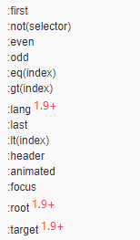
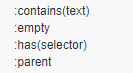
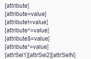
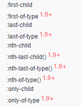
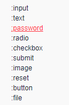
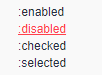
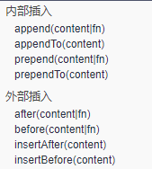
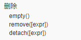
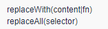
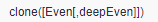

## JQuery

- JQuery，就是Javascript和查询，是辅助JavaScript开发的Js类库

### 核心函数

#### jQuery(callback)

- 是$(document).ready()的简写

- 页面加载完成后，指定的函数会执行

- 最完整的写法：
  
  ```javascript
  jQuery(document).ready(function(){
      // 执行的
  });
  ```

- 简写1：
  
  ```javascript
  $(document).ready(function(){
      // 执行的
  });
  ```

- jQuery就等于$符号

- 简写2
  
  ```javascript
  jQuery(function(){
      // 实现的
  })
  ```

- 简写3
  
  ```javascript
  $(function(){
      // 实现的
  })
  ```

#### JQuery(html,[ownerDocument])

- 将一个DOM对象包装成Jquery对象

- jquery中定义的方法和属性，都是只有jquery对象才可以调用

- 参数1：html代码

- 参数2：可选，设置DOM的相关属性

#### jQuery([selectot,[context]])

- 用于在页面上查找，根据CSS选择器

- 参数1：CSS选择器，jquery中提供了九种选择器

- 参数2：context，指定要查找的DOM集

### jquery对象和DOM对象之间的转换

- DOM对象 ---> jquery对象：$(DOM)

- jquery对象 ---> DOM对象：jquery对象[0] / jquery.get(0)

- 示例：
  
  ```html
  <body>
      <div id="element"></div>
  </body>
  ```
  
  ```javascript
  <script>
      $(function () {
          // 获取div的DOM对象
          var domElement = document.getElementById("element");
          // 获取jquery对象
          var jqueryElement = $("#element");
  
          // DOM对象 ---> jquery对象
          $(domElement).html("这是往html中添加内容");
  
          // jquery对象 ---> DOM对象
          jqueryElement.get(0).innerHTML = "这是往html中添加内容";
      })
  </script>
  ```

### 选择器

#### 基本选择器

- #id：根据id属性查找一个元素

- element：根据元素的标签名称查找元素

- .class：根据元素的class属性查找元素

- *：匹配所有元素

- selector1，selector2，selectorN：将每一个选择器匹配到元素后合并返回

- 代码示例：
  
  ```html
  <body>
      <div id="d1">张三</div>
      <div class="d2">李四</div>
      <div class="d2">王五</div>
      <div>赵六</div>
      <div>赵七</div>
  </body>
  ```

- 使用基本选择器获取以上元素：
  
  ```javascript
  <script>
      $(function () {
          // 通过id属性获取元素
          var html1 = $("#d1").html(); // 使用html()方法获取元素的所有html
          var html2 = $("#d1").text(); // 使用text()方法获取元素的文本内容
          console.log(html1);
          console.log(html2);
  
          // 通过class属性的获取元素
          // 使用each()方法为每个匹配的元素作为上下文来执行一个函数
          $(".d2").each(function (i) {
              // 由于this是一个DOM对象，则需要转换为jquery对象
              console.log($(this).html()); // 获取每个元素的内容
          })
  
          // 获取标签名的所有元素
          var div = $("div");
          // 通过index()方法可以获取元素中指定的元素的索引
          var index = div.index($("#d1"));
          console.log(index);
          // 通过length属性可以返回元素的个数
          var length= div.length;
          console.log(length);
  
          // 将多个选择器合并一起获取元素
          var selector = $("#d1, .d2");
          selector.html("java"); // 将内容设置为java
      })
  </script>
  ```

#### 层级选择器’

- 根据元素的关系来获取，关系是指父子关系，兄弟关系，层级选择器有以下四个：

- 空格：得到元素下的所有子元素（包含直接子元素与间接子元素）

- 大于号 > ：只获取直接的子元素

- 加号 + ：只获取直接的兄弟元素

- 波浪线 ~ ：所有后边的兄弟元素

- 代码示例：
  
  ```html
  <body>
      <div id="d1">
          <a href="javascript:;">Java</a>
          <p>
              <a href="javascript:;">IOS</a>
          </p>
          <a href="javascript:;">Android</a>
      </div>
      <p>PHP</p>
      <p>Python</p>
  </body>
  ```

- 使用层级选择器获取以上元素：
  
  ```javascript
  <script>
      $(function () {
          // 获取id="d1"的所有a标签的子元素
          console.log($("#d1 a").length);
  
          // 获取id="d1"的直接a标签的子元素
          console.log($("#d1 > a").length);
  
          // 获取id="d1"的p标签的直接兄弟元素
          console.log($("#d1 + p").html());
  
          // 获取id="d1"的p标签的所有兄弟元素
          console.log($("#d1 ~ p").length);
      })
  </script>
  ```

#### 过滤器

- 是在基本选择器和层级选择器获取到一批元素后，在进行过滤操作

- 过滤选择器基本都是 ":" 开头，除了属性过滤选择器

##### 基本过滤选择器



- 代码示例：
  
  ```html
  <body>
      <h1>商品信息</h1>
      <table border="1">
          <tr>
              <td>商品编号</td>
              <td>商品名称</td>
              <td>价格</td>
              <td>数量</td>
          </tr>
          <tr>
              <td>01</td>
              <td>电视机</td>
              <td>2100</td>
              <td>100</td>
          </tr>
          <tr>
              <td>01</td>
              <td>电视机</td>
              <td>2100</td>
              <td>100</td>
          </tr>
          <tr>
              <td>01</td>
              <td>电视机</td>
              <td>2100</td>
              <td>100</td>
          </tr>
          <tr>
              <td>01</td>
              <td>电视机</td>
              <td>2100</td>
              <td>100</td>
          </tr>
      </table>
  </body>
  ```

- 使用基本过滤选择器获取以上元素
  
  ```javascript
  <script>
      $(function () {
          // 获取所有tr中的第一个
          $("tr:first").css("color", "red");
  
          // 去除所有与给定选择器匹配的元素
          $("tr:not(tr:first)").css("color", "blue");
  
          // 匹配所有大于给定索引值的元素
          $("tr:gt(1)").css("color", "yellow");
  
          // 匹配所有索引值为偶数的元素，从 0 开始计数
          $("tr:even").css("color", "red");
          // 匹配所有索引值为奇数的元素，从 0 开始计数
          $("tr:odd").css("color", "blue");
  
          // 匹配如 h1, h2, h3之类的标题元素
          $(":header").css("color", "gray");
      })
  </script>
  ```

##### 内容过滤选择器

- 根据元素内部文本内容进行选中
  
  

- 代码示例
  
  ```html
  <body>
      <div>Java</div>
      <div>IOS</div>
      <div></div>
      <div>
          <a href="javascript:;">PHP</a>欢迎你
      </div>
      <div>
          Hello<a href="javascript:;">World</a>
      </div>
      <div>
          <span>今天天气真不错</span>
      </div>
  </body>
  ```

- 使用内容过滤选择器获取元素
  
  ```javascript
  <script>
      $(function () {
          // 匹配包含给定文本的元素
          $("div:contains('Java')").css("color", "red");
  
          // 匹配所有不包含子元素或者文本的空元素
          $("div:empty").html("这是一个空的div");
  
          // 匹配含有选择器所匹配的元素的元素
          // $("div:has(a)").addClass("styleName"); // 可以指定css的样式名
          $("div:has(a)").css("color", "yellow");
  
          // 匹配含有子元素或者文本的元素
          $("span:parent").css("color", "green");
      })
  </script>
  ```

##### 可见过滤选择器

- 匹配display:none或者表单中input hidden这样的元素

- :hidden

- :visible

- 代码示例
  
  ```html
  <body>
      <form action="">
          <input type="text" name="email"><br>
          <input type="hidden" name="id" value="10">
      </form>
      <table>
          <tr style="display: none">
              <td>Value 1</td>
          </tr>
          <tr>
              <td>Value 2</td>
          </tr>
          <tr>
              <td>Value 3</td>
          </tr>
      </table>
  </body>
  ```

- 使用可见过滤选择器获取以上元素
  
  ```javascript
  <script>
      $(function () {
          // 获取隐藏的值
          var val = $("input:hidden").val();
          console.log(val);
  
          // 设置所有可见的样式
          $("tr:visible").css("background", "blue");
  
          // 获取input的value值
          console.log($("input:hidden").val());
  
          // 将隐藏的tr显示出来
          $("tr:hidden").show();
  
          // 将显示的tr隐藏起来
          $("tr:visible").hide();
      })
  </script>
  ```

##### 属性过滤选择器

- 根据元素的属性进行过滤
  
  

- ^=：匹配开始

- $=：匹配结尾

- *=：匹配包含

- 代码示例：
  
  ```html
  <body>
      <div id="d1">
          这是一个div
      </div>
      <form action="">
          <input type="text" name="username" value="tom"><br>
          <input type="checkbox" class="item1" name="food" value="米饭">米饭
          <input type="checkbox" class="item2" name="food" value="牛奶">牛奶
          <input type="checkbox" class="item3" name="food" value="羊肉">羊肉
          <hr>
          <input type="checkbox" class="itm1" name="hobby" value="篮球">篮球
          <input type="checkbox" class="itm2" name="hobby" value="足球">足球
          <input type="checkbox" class="itm3" name="hobby" value="羽毛球">羽毛球
      </form>
      <span id="s">
          这是一个span
      </span>
  </body>
  ```

- 使用属性过滤选择器获取以上元素
  
  ```javascript
  <script>
      $(function () {
          // 匹配包含给定属性的元素
          $("div[id]").css("color", "red");
  
          // 匹配给定的属性是某个特定值的元素
          console.log($("input[name='username']").val());
  
          // 获取type='checkbox'的元素
          var input = $("input[type='checkbox']");
          input.attr("checked", true); // 设置checked属性
  
          $("input[type='checkbox'][class *= 'item']").attr("checked", false);
      })
  </script>
  ```

##### 子元素过滤选择器

- 根据子元素顺序来获取
  
  

- 代码示例
  
  ```html
  <body>
      <ul>
          <li>Java</li>
          <li>Ios</li>
          <li>Python</li>
          <li>Android</li>
      </ul>
      <ul>
          <li>张三</li>
          <li>李四</li>
          <li>王五</li>
      </ul>
      <ul>
          <li>PHP</li>
      </ul>
  </body>
  ```

- 使用子元素过滤选择器获取元素
  
  ```javascript
  <script>
      $(function () {
          // 设置列表中第二个li中的样式
          $("ul li:nth-child(2)").css("color", "red");
  
          // 设置列表中最后一行的样式
          $("ul li:last-child").css("color", "blue");
  
          // 获取列表中只有一行的样式
          $("ul li:only-child").css("color", "green");
      })
  </script>
  ```

##### 表单过滤选择器

- 用于获取表单中的元素
  
  

##### 表单对象过滤选择器



### 属性和方法

- html()方法：无参数代表获取元素中的html代码，如果由参数则代表设置元素的html信息

- text()方法：无参数代表获取元素中的文本信息，如果有参数代表甚至元素的文本信息

- each()方法
  
  - 可以帮助我们遍历元素，可以传递一个函数
  
  - each(function(n){}，n代表了每一个元素的序号，在函数中可以通过this来获取DOM对象

- index()方法，可以查找指定元素的序号

- length属性，可以获取元素的个数

- css()方法，可以设置元素的样式
  
  - 如果只有一个参数，则获取该的属性的值
    
    ```javascript
    $("p").css("color");
    ```
  
  - 如果有两个参数，则设置该属性的值
    
    ```javascript
    $("p").css("color","red");
    ```
  
  - 如果有多个属性，则设置多个属性的值，用大括号将其包裹起来
    
    ```javascript
    $("p").css({ "color": "#ff0011", "background": "blue" });
    ```

- show()方法：将隐藏的元素显示出来

- hide()方法：将显示的元素隐藏起来

- val()方法：获取元素当前的value值

- attr()方法：设置或返回被选元素的属性值。

### JQuery DOM操作

### 插入



- 代码示例
  
  ```html
  <body>
      <select name="" id="edu">
          <option value="小学">小学</option>
          <option value="中学">中学</option>
          <option value="本科">本科</option>
      </select>
  
      <select name="" id="hobby">
          <option value="篮球">篮球</option>
          <option value="足球">足球</option>
      </select>
  </body>
  ```

- 使用外部插入和内部插入插入元素
  
  ```javascript
  <script>
      $(function () {
          // 内部插入
          // 在id='edu'中开始添加一项<option value='幼儿园'>幼儿园</option>
          $("#edu").prepend($("<option value='幼儿园'>幼儿园</option>"));
          // $("<option value='幼儿园'>幼儿园</option>").prependTo($("#edu"));
  
          // 在id='edu'中最后添加一项<option value='研究生'>研究生</option>
          $("#edu").append($("<option value='研究生'>研究生</option>"));
          // $("<option value='研究生'>研究生</option>").appendTo($("#edu"));
  
          // 外部插入
          // 在id='hobby'中开始添加一项<option value='羽毛球'>羽毛球</option>
          $("#hobby option:first").before($("<option value='羽毛球'>羽毛球</option>"));
          // $("<option value='羽毛球'>羽毛球</option>").insertBefore($("#hobby option:first"));
  
          // 在id='hobby'中最后添加一项<option value='乒乓球'>乒乓球</option>
          // $("#hobby option:last").after($("<option value='乒乓球'>乒乓球</option>"));
          $("<option value='乒乓球'>乒乓球</option>").insertAfter($("#hobby option:last"));
      })
  </script>
  ```

#### 删除



- 代码示例
  
  ```html
  <body>
      <div id="d1">
          <p>pppppp</p>
          <span>ssssssss</span>
      </div>
      <div id="d2"></div>
  </body>
  ```

- 删除以上元素
  
  ```javascript
  <script>
      $(function () {
          // 将子元素所有删除
          // $("#d1").empty();
  
          // remove()和detach()功能都是删除
          $("#d1 p").remove();
          // $("#d1 p").detach();
  
          // remove()和detach()的区别：
          // remove()删除时连注册事件也删除
          // detach()删除时不删除事件
      })
  </script>
  ```

#### 替换与复制

- 替换操作
  
  

- 复制操作
  
  

### 事件

- JQuery中的事件和Javascript中事件的区别
  
  - JQuery中事件允许绑定多个函数
  
  - Javascript中的一个事件只能绑定一个函数

#### 事件绑定

- 简化方式一：
  
  ```javascript
  $("#btn").click(function () {
      // 实现的代码
  })
  ```

- 简化方式二：使用bind()方法【3.0版本已经淘汰】，可以使用
  
  ```javascript
  $("#btn").bind("click", function () {
      // 实现的代码
  })
  ```

- 解除绑定：unbind()方法
  
  ```javascript
  $("#btn").unbind("click");
  ```

- 使用on()方法替代bind()方法
  
  ```javascript
  $("#btn").on("click", function () {
      alert(123);
  })
  ```

- 一次性事件，只会执行一次
  
  ```javascript
  $("#btn").one("click", function () {
      alert("123");
  })
  ```

- 事件触发
  
  ```javascript
  $("#btn").click(function () {
      alert("123");
  });
  
  $("#btn").on("mouseover", function () {
      $(this).trigger("click");
  })
  ```

#### 事件切换-hover

- 可以绑定两个函数，当触发mouseover时第一个函数执行，当触发mouseout时第二个函数执行
  
  ```javascript
  <script>
      $(function () {
          $("h1").hover(function () {
              // 鼠标移入执行
          },function () {
              // 鼠标移出时执行
          })
      })
  </script>
  ```
