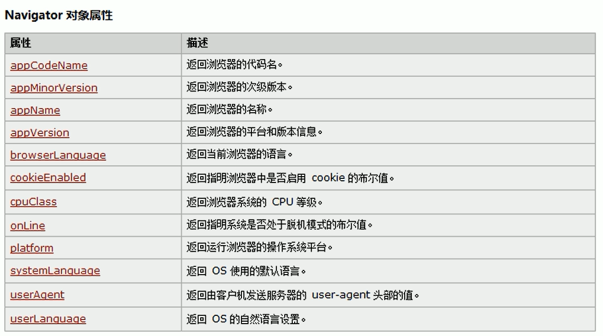
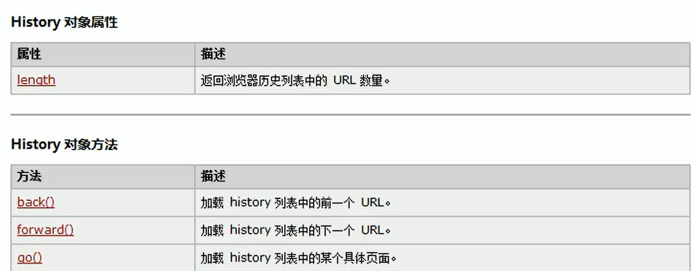
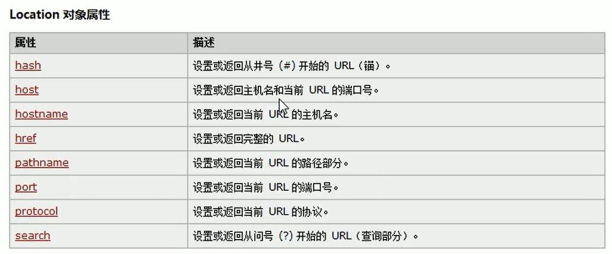
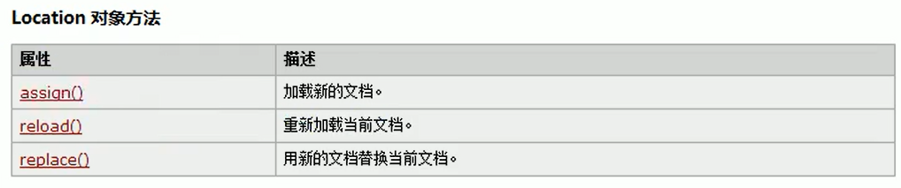

## BOM

- 浏览器对象模型

- 可以通过JS来操作浏览器

- BOM对象
  
  - Window：代表整个浏览器的窗口，同时Windo也是网页中的全局对象
  
  - Navigator：代表当前浏览器的信息，通过该对象可以来识别不同的浏览器
  
  - Location：代表当前浏览器的地址栏信息，可以获取地址栏信息，或者操作浏览器跳转页面
  
  - History：代表浏览器的历史记录，可以操作浏览器的历史记录，只能操作浏览器向前后向后翻页，只在当次访问时有效
  
  - Screen：代表用户的屏幕信息，可以获取到用户显示屏的相关信息

- 这些BOM对象在浏览器中都是作为window对象的属性保存的，可以通过window对象来使用，也可以直接使用

### Navigator对象

- 由于历史原因，Navigator对象中的大部分属性都已经不能帮助我们识别浏览器了

- 一般只会使用userAgent来判断浏览器的信息

- userAgent是一个字符串，包含有用来描述浏览器信息的内容

- 不同浏览器有不同的userAgent

### History

- 可以用来操作浏览器向前或者向后翻页

### Location

- 封装了浏览器的地址栏信息

- 如果直接打印location，则可以直接获取到地址栏信息

- 如果直接将location属性修改为其他路径（完整路径或者相对路径），则页面会自动跳转到该路径中

