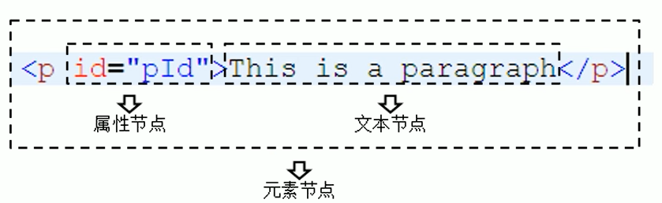

## DOM

- DOM，Document Object Model文档对象模型

- JS中通过DOM来对HTML文档进行操作
  
  - 文档：表示的就是整个HTML网页文档
  
  - 对象：表示将网页中的每一个部分都转换为一个对象
  
  - 模型：表示对象之间的关系，方便获取对象

### 节点

- 节点，是构成网页的最基本的组成部分，网页中的每一个部分都可以称为是一个节点
  
  - 文档 --> 文档节点（整个HTML文档）
  
  - 标签 --> 元素节点（HTML文档中的HTML标签）
  
  - 属性 --> 属性节点（元素的属性）
  
  - 文本 --> 文本节点（HTML标签中文本内容）

- 浏览器已经提供了**文档节点** 对象
  
  ```javascript
  document这个
  ```

- 例如：在JS中获取HTML中的btn按钮
  
  ```html
  <body>  
      <button id="btn">按钮</button>  
      <script>
          var btn = document.getElementById("btn");  
          console.log(btn);  
      </script>  
  </body>
  ```

### 事件

- 事件，就是文档或者浏览器窗口中发生的一些特定的交互瞬间

- JavaScript和HTML之间的交互就是通过事件实现的

- 例如：点击按钮，鼠标移动，关闭窗口等

- 可以在事件对应的属性中设置一些JS代码，这样当事件被触发时，代码会执行【不推荐】
  
  ```html
  <button id="btn" onclick="alert('被点击')">按钮</button>
  ```

- 属性事件：[HTML DOM 事件对象 | 菜鸟教程](https://www.runoob.com/jsref/dom-obj-event.html)

- 可以通过给标签的对应事件绑定处理函数的形式来响应事件，当事件被触发，代码会被执行【推荐】
  
  例如：给按钮的点击事件绑定函数
  
  ```html
  <body>
      <button id="btn">按钮</button>
      <script>
          var btn = document.getElementById("btn");
          btn.onclick = function () {
              alert("被点击");
          };
      </script>
  </body>
  ```

### 文档加载

- 浏览器在加载一个页面时，是按照自上而下的顺序来加载的，读取一行就执行一行

- 如果将script标签写到页面的上边，在代码执行时，页面还没有加载

- 解决方式1：将js编写到页面的下面，这样就可以在页面加载完后执行JS代码
  
  ```html
  <body>
      <button id="btn">按钮</button>
      <script>
          var btn = document.getElementById("btn");
          btn.onclick = function () {
              alert("被点击");
          };
      </script>
  </body>
  ```

- 解决方式2：为window绑定一个onload事件，在整个页面加载完后才触发
  
  ```html
  <!DOCTYPE html>
  <html lang="en">
  <head>
      <meta charset="UTF-8">
      <title>Title</title>
      <script>
          window.onload = function () {
              var btn = document.getElementById("btn");
              btn.onclick = function () {
                  alert("被点击");
              };
          }
      </script>
  </head>
  <body>
      <button id="btn">按钮</button>
  </body>
  </html>
  ```

### 获取元素节点的方式

通过document对象调用

- getElementById()：通过id属性获取一个元素节点对象

- getElementsByTagName()：通过标签名获取一组元素节点对象

- getElementsByName()：通过name属性获取一组元素节点对象

#### getElementById()

- 通过id属性获取一个元素节点对象
  
  ```javascript
  var bj = document.getElementById("bj");
  console.log(bj.innerHTML);
  ```
  
  以上代码，通过innerHtml这个属性可以获取到元素内部的html代码

#### getElementByTagName()

- 通过标签名获取一组元素节点对象

- 会返回一个类数组对象，所有查询到的元素都会封装到对象中
  
  ```javascript
  var list = document.getElementsByTagName("li");
  // 获取第一个
  console.log();
  ```

#### getElementsByName()

- 通过name属性获取一组元素节点对象
  
  ```javascript
  var byName = document.getElementsByName("gender");
  ```

#### getElementsByClassName()

- 根据元素的class属性值查询一组元素节点对象
  
  ```javascript
  var boxs = document.getElementsByClassName("box");
  
  
  ```

```

// 获取第一个
var box = boxs[0];

```

#### querySelector()

- 根据一个CSS选择器来查询一个元素节点对象

- 只会返回一个元素，如果有多个元素满足条件，则返回第一个元素

```javascript
var divElement = document.querySelector(".box1 div");
```

#### querySelectorAll()

- 和querySelector()类似

- 不同的是有多个元素满足时，会封装到一个数组中，并返回

#### 读取元素节点属性

语法：元素.属性名

例如：元素.id、元素.name、元素.value

**注意：class属性不能用以上方式，需要使用：元素.className**

#### 获取元素节点的子节点

- getElementsByTagName()方法，返回当前节点的指定标签名后代节点
  
  ```javascript
  var city = document.getElementById("city");
  var liList = city.getElementsByTagName("li");
  for (let i = 0; i < liList.length; i++) {
      console.log(liList[i]);
  }
  ```

- childNodes属性，表示当前节点的所有子节点
  
  会获取包括文本节点在内的所有节点
  
  标签之间的空白也会被当前文本节点
  
  ```javascript
  var city = document.getElementById("city");
  var childNodes = city.childNodes;
  ```

- children属性，可以获取当前元素的所有子元素，不包括文本节点
  
  ```javascript
  var city = document.getElementById("city");
  var children = city.children;
  ```

- firstChild属性，表示当前节点的第一个子节点

- firstElementChild属性，获取当前元素的第一个子元素

- lastChild属性，表示当前节点的最后一个子节点

- lastElementChild属性，获取当前元素的最后一个子元素

#### 获取父节点和兄弟节点

- parentNode属性，表示当前节点的父节点

- previousSibling属性，表示当前节点的前一个兄弟节点（可能获取空白文本）

- previousElementSibling属性，表示当前节点的前一个兄弟元素（不会获取空白文本）

- nextSibling属性，表示当前节点的后一个兄弟节点

#### 读取和设置元素的value属性

```javascript
var username = document.getElementById("username");
console.log(username.value);
username.value = "张三";
```

### 获取body标签

- 方式一：通过getElementsByTagName()方法
  
  ```javascript
  document.getElementsByTagName("boby")[0];
  ```

- 方式二：使用document中的body属性
  
  ```javascript
  document.boby;
  ```

### 增删改

#### createElement()

- 创建元素节点对象

- 需要一个标签名作为参数，将会根据标签名创建元素节点对象，并将创建好的对象作为返回值返回
  
  ```javascript
  var element = document.createElement("li");
  ```

#### createTextNode()

- 创建一个文本节点对象

- 需要一个文本内容作为参数，会根据内容创建文本节点对象，并将新节点返回
  
  ```javascript
  var text = document.createTextNode("广州");
  ```

#### appendChild()

- 向一个父节点中添加一个新的子节点

- 用法：父节点.appendChild(子节点);
  
  ```javascript
  // 创建元素节点
  var element = document.createElement("li");
  
  // 添加文本节点
  var text = document.createTextNode("广州");
  
  // 向父节点添加子节点
  element.appendChild(text);
  ```

- 也可以使用innerHTML完成增加操作
  
  ```javascript
  var city = document.getElementById("city");
  city.innerHTML += "<li>广州</li>";
  ```

#### insertBefore()

- 可以在指定的子节点前插入新的子节点

- 语法：父节点.insertBefore(新节点，旧节点);
  
  ```javascript
  // 创建元素节点
  var element = document.createElement("li");
  // 创建文本节点
  var text = document.createTextNode("广州");
  // 向父节点中插入子节点
  element.appendChild(text);
  
  var city = document.getElementById("city");
  var bj = document.getElementById("bj");
  
  // 在指定的子节点前插入子节点
  city.insertBefore(element, bj);
  ```

#### replaceChild()

- 可以使用指定的子节点替换已有的子节点

- 语法：父节点.replaceChild(新节点，旧节点);
  
  ```javascript
  // 创建元素节点
  var element = document.createElement("li");
  // 创建文本节点
  var text = document.createTextNode("广州");
  // 向父节点中插入子节点
  element.appendChild(text);
  
  var city = document.getElementById("city");
  var bj = document.getElementById("bj");
  
  // 使用指定子节点替换已有的子节点
  city.replaceChild(element, bj);
  ```

#### removeChild()

- 可以删除一个子节点

- 语法：父节点.removeChild(子节点); 或者 子节点.parentNode.removeChild(子节点);
  
  ```javascript
  var city = document.getElementById("city");
  var bj = document.getElementById("bj");
  
  city.removeChild(bj);
  ```

- 删除子节点的方式2：
  
  ```javascript
  var bj = document.getElementById("bj");
  bj.parentNode.removeChild(bj);
  ```

### 操作CSS样式

#### 修改样式

- 语法：元素.style.样式名 = 样式值;

- 例如：修改宽度
  
  ```javascript
  box1.style.width = "300px";
  ```

- **注意：如果CSS的样式名中含有 “-”，这种名称在JS中使用不行的，需要将这种样式名修改为驼峰命名法**
  
  ```javascript
  box1.style.backgroundColor = "yellow";
  ```

- 通过style属性设置的样式都是内联样式，而内联样式有较高的优先级，所以通过JS修改的样式会立即显示

- 如果在样式中写了 **!important** ，此时样式会有最高的优先级，即使通过JS也不能覆盖样式，将会导致JS修改样式失效

#### 读取样式

##### 方式一：通过style属性

- 语法：元素.style.样式名
  
  ```javascript
  console.log(box1.style.width);
  ```

- 通过style属性设置和读取的都是内联样式，无法读取样式表中的样式

##### 方式二：通过getComputedStyle()方法

- 可以获取元素当前的样式
  
  - 参数1：要获取样式的元素
  
  - 参数2：可以传递一个伪元素，一般都传null

- 该方法会返回一个对象，对象中封装了当前元素对应的样式、
  
  ```javascript
  var obj = getComputedStyle(box1, null);
  console.log(obj.width);
  ```

#### 其他相关样式的属性

##### 返回元素可见高度和宽度

- 这些属性都是不带px的，都是返回一个数字，可以直接进行计算

- 会获取元素宽度和高度，包括内容区和内边距

- 这些属性都是只读的

```javascript
console.log(box1.clientHeight);
console.log(box1.clientWidth);
```

##### 返回元素的高度和宽度

- 获取元素的整个的高度和宽度，包括内容区、内边距和边框
  
  ```javascript
  console.log(box1.offsetHeight);
  console.log(box1.offsetWidth);
  ```

##### offsetParent

- 可以用来获取当前元素的定位父元素

- 会获取离当前元素最近的、开启了定位的祖先元素，如果所有祖先元素都没有开启定位，则返回body
  
  ```javascript
  console.log(box1.offsetParent);
  ```

##### offsetLeft和offsetTop

- offsetLeft：当前元素相对于其定位元素的水平偏移量 

- offsetTop：当前元素相对于其定位元素的垂直偏移量
  
  ```javascript
  console.log(box1.offsetLeft);
  console.log(box1.offsetTop);
  ```

##### scrollWidth和scrollHeight

- scrollWidth：可以获取元素整个滚动区的宽度

- scrollHeight：可以获取元素整个滚动区的高度
  
  ```javascript
  console.log(box1.scrollHeight);
  console.log(box1.scrollWidth);
  ```

##### scrollLeft和scrollTop

- scrollLeft：可以获取水平滚动条滚动的距离

- scrollTop：可以获取垂直滚动条滚动的距离
  
  ```javascript
  console.log(box1.scrollLeft);
  console.log(box1.scrollTop);
  ```

### 事件冒泡

- 就是事件的向上传导，当后代元素上的事件被触发时，其祖先元素的相同事件被触发

- 如果不希望发生事件冒泡可以通过事件对象来取消冒泡
  
  ```javascript
  document.onmousemove = function (event) {
      event.cancelBubble = true;
  }
  ```

### 事件委派

- 将事件统一绑定给元素的共同祖先元素，这样当后代元素上的事件被触发时，会一致冒泡到祖先元素，从而通过祖先元素的响应函数来处理事件

- 事件委派利用了冒泡。通过委派可以减少事件绑定的次数，提高程序的性能

- target：event中的tartget表示触发事件的对象

### 事件绑定

- 通过addEventListener方法，可以为元素绑定响应函数
  
  - 参数1：事件的字符串，不要on
  
  - 参数2：回调函数，当事件触发时，函数被调用
  
  - 参数3：是否在捕获阶段触发事件，需要一个布尔值，一般都传false
    
    ```javascript
    btn.addEventListener("click", function () {
    
    }, false);
    ```

- 当有多个事件被绑定时，响应函数会将按照函数的绑定顺序执行


